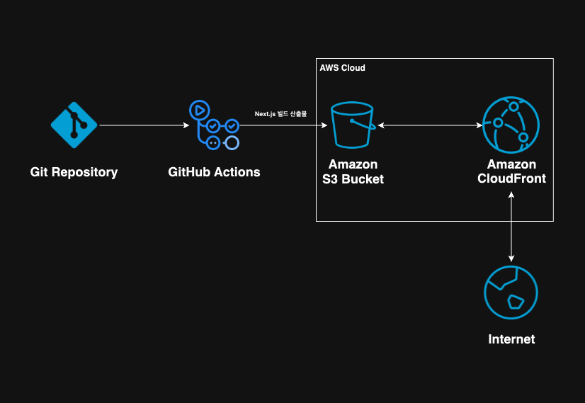
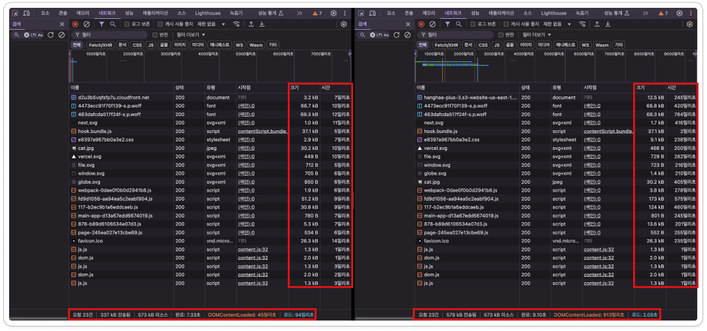

## 프론트엔드 배포 파이프라인 정리

### 개요

1. 개발 완료 후 main 브랜치로 푸시
   - 코드는 GitHub Actions 워크플로를 통해 배포 파이프라인을 시작합니다.
2. GitHub Actions에서 S3 업로드
   - 프로젝트의 빌드 파일을 AWS S3 버킷에 업로드하여 정적 호스팅 준비를 완료합니다.
3. CloudFront로 사용자에게 제공
   - CloudFront를 통해 CDN으로 사용자에게 콘텐츠를 제공하고, 캐시 무효화를 통해 최신 데이터가 즉시 반영되도록 합니다.



### GitHub Actions 워크플로

#### 1. 코드 린트 단계

- 저장소 체크아웃: 소스 코드를 Actions 워크플로로 가져옵니다.
- Node.js 설정: Node.js v20으로 환경을 구성합니다.
- Node 모듈 캐싱:
  - package-lock.json과 비교하여 설치해야 할 모듈이 있으면 새로 설치 및 캐싱합니다.
  - 이미 캐싱된 모듈이 유효하면 이를 재사용하여 설치 시간을 단축 시킵니다.
- 의존성 설치 후 린트 실행:
  - 린트 도구를 사용하여 코드 스타일과 안정성을 점검합니다.

#### 2. 배포 단계

- 빌드
  - 캐싱된 Node 모듈을 사용해 프로젝트를 빌드합니다.
- AWS 자격 증명 설정:
  - GitHub Secrets에 저장된 AWS Access Key 및 Secret Key를 사용해 인증합니다.
- S3 업로드:
  - 빌드된 정적 파일을 S3 버킷에 업로드 및 동기화합니다.
- CloudFront 캐시 무효화:
  - 사용자에게 최신 파일을 제공하기 위해 캐시를 무효화합니다.

## 주요 링크

- S3 버킷 웹사이트 엔드포인트: http://hanghae-plus-3.s3-website-us-east-1.amazonaws.com/
- CloudFront 배포 도메인 이름: https://d2u3b5vqfsfp7u.cloudfront.net/

## 주요 개념

> ### GitHub Actions과 CI/CD 도구

#### GitHub Actions

- CI/CD도구 중 하나로, 별도의 설정없이 GitHub와 연동하여 사용할 수 있습니다.
- 간단한 YAML 파일로 다양한 작업을 쉽게 할 수 있습니다.

#### CI/CD 도구

- GitHub Actions, Jenkins, CircleCI 등 다양한 도구가 있으며, 코드 변경 시 테스트, 빌드, 배포를 자동화 할 수 있습니다.
- CI 단계에서 테스트 또는 린트를 실행하여 코드의 안정성과 품질을 높일 수 있습니다.

</br>

> ### S3와 스토리지

#### S3

- AWS에서 제공하는 객체 스토리지 서비스로, 대규모 데이터를 안전하게 저장할 수 있습니다.
- 주로 정적 파일을 저장하는데 사용합니다.

#### 스토리지

- 스토리지는 데이터를 저장하는 넓은 개념을 의미하며, 이 안에는 여러 종류의 저장 방식이 포함합니다.
- 파일 시스템, 블록 스토리지, 객체 스토리지 등이 있습니다.

<br/>

> ### CloudFront와 CDN

#### CloudFront

- AWS에서 제공하는 글로벌 CDN 서비스로, 엣지 서버를 통해 콘텐츠를 캐싱하고 사용자에게 빠르고 효율적인 콘텐츠 전달을 제공합니다.
- S3, EC2와 같은 AWS 서비스와 통합되어, AWS 인프라 내에서 호스팅되는 웹사이트나 애플리케이션에 최적화된 콘텐츠 전송 솔루션을 제공합니다.

#### CDN

- 콘텐츠 전송 네트워크로, 전 세계에 분산된 서버를 통해 웹 콘텐츠를 빠르고 효율적으로 사용자에게 전달하는 시스템이다.
- 주로 웹 페이지, 이미지, 비디오, 자바스크립트 파일, CSS 파일 등의 정적 콘텐츠를 캐싱하여 사용자에게 더 빠르게 제공할 수 있게 합니다.

</br>

> ### 캐시 무효화(Cache Invalidation)

- 기존 캐싱된 데이터를 지우고, 최신 데이터를 제공하기 위해 사용합니다.
- CloudFront에서는 특정 경로나 파일을 지정해 무효화 가능, 이를 통해 변경 사항을 실시간으로 반영합니다.
- 캐시 무효화 동작 시점
  - 명시적 요청:
    - AWS cloudfront create-invalidation 실행합니다.
    - 이때 특정 경로를 설정하면, 해당 경로에 있는 파일만 무효화 된다.
  - 캐시 만료:
    - 기본 TTL(Time to Live) 시간(24시간) 초과시 캐시가 만료되고, 새로운 요청이 들어오면 최신 데이터를 가져온다.
  - 파일 변경:
    - ETag 또는 Last-Modified 변경시 캐시 무효화가 동작합니다.
    - ETag(Entity Tag): 파일의 고유한 식별자로, 파일 내용이 변경될 때마다 값이 바뀌는 헤더입니다..
    - Last-Modified: 파일이 마지막으로 수정된 시간을 나타내는 헤더입니다.
  - 배포 업데이트:
    - CloudFront 배포 설정이 변경되면, 해당 배포의 캐시 설정(예: TTL, 경로 매칭 등)이 업데이트됩니다.
    - 이 경우, 캐시가 새로운 배포 설정에 맞게 업데이트되도록 무효화가 자동으로 발생할 수 있습니다.
    - 배포 업데이트는 CloudFront 배포에 적용되는 설정을 변경하는 작업으로, 예를 들어, 배포의 캐시 정책이나 경로 패턴을 변경하면, 캐시가 새로운 설정을 반영하기 위해 무효화될 수 있습니다.

<br/>

> ### Repository secret과 환경변수

### Repository secret

- GitHub Actions에서 사용되는 보안 환경 변수로 주로 민감한 데이터를 안전하게 저장하고 사용할때 사용합니다.
  - 예) API 키, 클라우드 자격증명, 데이터베이스 비밀번호 등을 저장.
- GitHub Settings → Secrets and variables → Actions 에서 설정 가능합니다.

### 환경변수

- 애플리케이션 실행 환경에서 필요한 설정 값을 저장하는 변수입니다.
  - 예) PORT 번호, 데이터베이스 경로, 외부 API URL 등.
- GitHub Actions에서는 env 키워드를 통해 워크플로 내에서 설정 가능합니다

```
env:
  NODE_ENV: production
  PORT: 3000
```

<br/>

## CDN 도입 여부에 따른 성능 개선 보고서

### 비교 환경

- **CloudFront** VS **S3**
- 측정 도구: 크롬 개발자 도구의 네트워크 탭
- 주요 비교 지표: 요청 수, DOMContentLoaded 시간, 전송된 데이터 크기

좌측 CloudFront 우측 S3



| 항목                      | CloudFront 배포 결과 | S3 배포 결과 | 차이점 및 분석                   |
| ------------------------- | -------------------- | ------------ | -------------------------------- |
| **요청 수**               | 23건                 | 23건         | 동일                             |
| **DOMContentLoaded 시간** | 45ms                 | 913ms        | 약 95% 성능 개선 (DOM 로드 시간) |
| **전송된 데이터 크기**    | 337KB                | 579KB        | 약 42% 데이터 전송량 감소        |

### 분석

1. 요청 수 동일

   - CDN 도입 여부와 관계없이 한 페이지에 필요한 리소스의 개수는 변하지 않지만, 개별 요청 처리 속도에서 큰 차이를 보입니다.

2. DOMContentLoaded 시간

   - CloudFront는 전 세계 분산 엣지 서버를 통해 사용자가 가장 가까운 위치에서 콘텐츠를 제공하여 전송 지연 시간을 크게 단축합니다.
   - S3만 사용하는 경우에는 원본 서버와의 거리 및 네트워크 속도에 따라 성능이 저하될 가능성이 큽니다.

3. 데이터 전송량 감소

   - CloudFront는 Gzip 및 Brotli 압축 형식을 사용하여 객체를 압축하여 크기를 줄이고, 캐싱 정책을 적용하여 필요한 데이터만 효율적으로 전송합니다.
   - S3는 CDN 기능이 없어 원본 데이터 그대로 전송되며, 사용자가 멀리 있을수록 속도 저하와 데이터 전송량 증가가 발생합니다.

### 요약

- CloudFront를 도입하지 않을 이유가 없다고 평가할 만큼 압도적인 성능 향상이 확인되었습니다.
- 95%의 DOM 로드 시간 단축과 42%의 데이터 전송량 감소는 사용자 경험(UX) 개선과 네트워크 부하 감소에 큰 기여를 합니다.
- 비용 우려가 있을 수 있으나, 성능과 확장성을 고려할 때 장기적인 비용 대비 효과가 더 크다고 판단됩니다.

### 결론

- CloudFront를 도입하는 것은 성능 최적화를 위해 가장 최선의 선택입니다.
